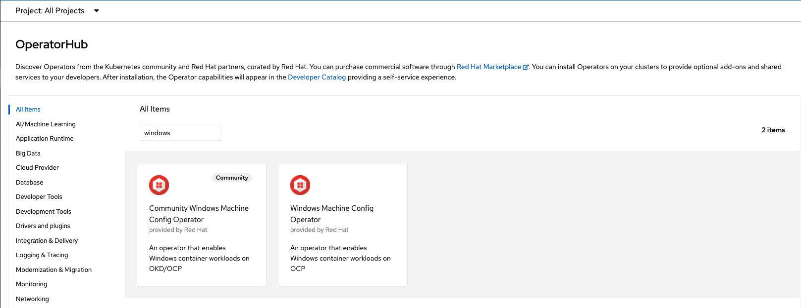
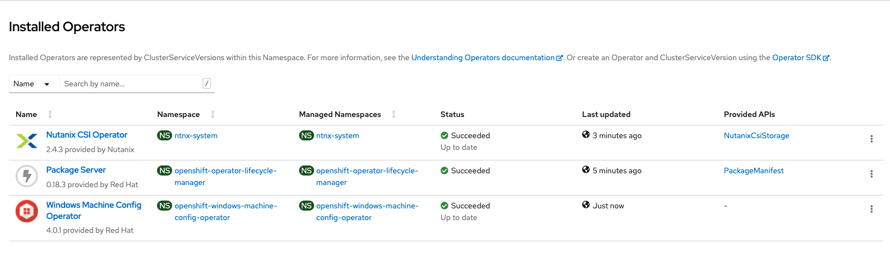

# Documentation to install a cluster with Linux & Windows worker nodes

## Context

In this documentation, I will present to you how to deploy a mix cluster with Linux and Windows node to host modern applications and legacy applications based on old dotnet framework.

## Lab environment

- A OpenShift cluster version 4.9
- Cluster deployed on virtual environment (Nutanix stack)
- 3 master nodes
- 3 Linux CoreOS worker nodes
- 1 Windows 2019 worker node
- 1 Windows 2022 worker node 

## Important prerequisites 

- A OCP4 cluster with OVN as network SDN
- SDN Hybrid configuration in place before cluster deployment 

## Deployment

### 1. Install a cluster with OVN-Kubernetes as SDN with hybrid configuration  
> :memo: https://docs.openshift.com/container-platform/4.9/networking/ovn_kubernetes_network_provider/configuring-hybrid-networking.html  

### 2. Deploy dedicated Windows operator via OperatorHub marketplace

> :memo: https://docs.openshift.com/container-platform/4.9/windows_containers/enabling-windows-container-workloads.html

> :warning: Click the Enable Operator recommended cluster monitoring on the Namespace checkbox to enable cluster monitoring for the WMCO.




### 3. Deploy your Windows nodes

Being on a platform not supporting MachineSet (AWS, Azure or vSphere), I deployed manually Windows VMs with fresh install to add them in a second time following documented Bring-Your-Own-Host (BYOH) process.  

After Windows VM deployed, you have just to install Docker engine and OpenSSH server on your nodes (documentend bellow) before to integrate the node to your OCP cluster.  

Please verify your deployment match with described prerequisites : https://docs.openshift.com/container-platform/4.9/windows_containers/byoh-windows-instance.html

### 4. Install Docker on your Windwos nodes  
> :memo: https://computingforgeeks.com/how-to-run-docker-containers-on-windows-server-2019/

In a Powershell windows :
````
Install-Module -Name DockerMsftProvider -Repository PSGallery -Force
````


### 5. Instal OpenSSH on your Windows nodes  
> :memo: https://docs.microsoft.com/en-us/windows-server/administration/openssh/openssh_install_firstuse

### 6. Configure Pub key on your Windows nodes  
> :memo: https://docs.microsoft.com/en-us/windows-server/administration/openssh/openssh_keymanagement
